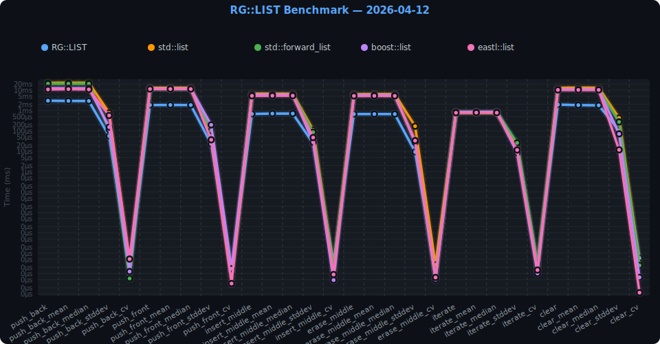
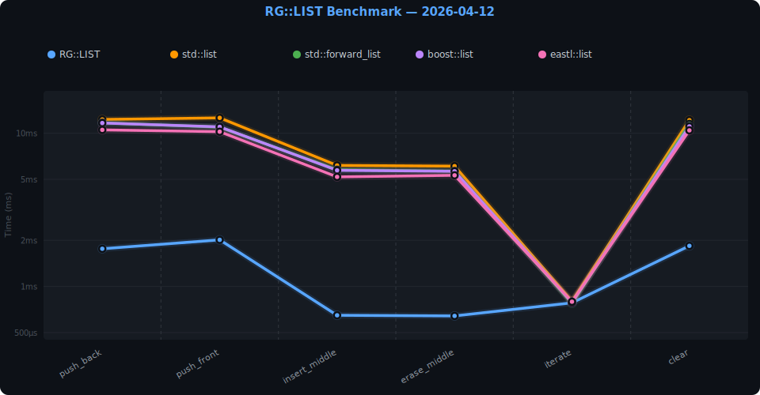

# 🏎️ Rinegine::Kernel::LIST Benchmark
> Данный тип временно находится в модуле WIP  

Сравнительный бенчмарк связного списка **RG::LIST** против 4 альтернатив:
`std::list`, `std::forward_list`, `boost::list`, `eastl::list`.

## 📊 Результаты

N=500 000 · GCC 15.2.1 `-O3 -march=native` · логарифмическая шкала  
## Подробные результаты с минимальной погрешностью  


<!-- include: RESULTS.md -->
| Operation | RG::LIST | std::list | std::forward_list | boost::list | eastl::list |
|---|---|---|---|---|---|
| **push_back** | 1.88 ms | 10.50 ms | 8.94 ms | 9.11 ms | 9.39 ms |
| **push_back_mean** | 1.88 ms | 10.41 ms | 8.91 ms | 9.00 ms | 9.39 ms |
| **push_back_median** | 1.88 ms | 10.38 ms | 8.94 ms | 9.02 ms | 9.39 ms |
| **push_back_stddev** | 0.01 ms | 0.08 ms | 0.22 ms | 0.12 ms | 0.13 ms |
| **push_back_cv** | 0.00 ms | 0.00 ms | 0.00 ms | 0.00 ms | 0.00 ms |
| **push_front** | 1.79 ms | 11.03 ms | 8.84 ms | 9.43 ms | 10.11 ms |
| **push_front_mean** | 1.79 ms | 10.95 ms | 8.75 ms | 9.35 ms | 9.97 ms |
| **push_front_median** | 1.79 ms | 10.98 ms | 8.74 ms | 9.43 ms | 10.05 ms |
| **push_front_stddev** | 0.00 ms | 0.09 ms | 0.08 ms | 0.24 ms | 0.19 ms |
| **push_front_cv** | 0.00 ms | 0.00 ms | 0.00 ms | 0.00 ms | 0.00 ms |
| **insert_middle** | 0.98 ms | 5.46 ms | 4.66 ms | 4.71 ms | 4.85 ms |
| **insert_middle_mean** | 0.96 ms | 5.47 ms | 4.69 ms | 4.72 ms | 4.87 ms |
| **insert_middle_median** | 0.95 ms | 5.46 ms | 4.70 ms | 4.71 ms | 4.88 ms |
| **insert_middle_stddev** | 0.02 ms | 0.08 ms | 0.03 ms | 0.02 ms | 0.02 ms |
| **insert_middle_cv** | 0.00 ms | 0.00 ms | 0.00 ms | 0.00 ms | 0.00 ms |
| **erase_middle** | 0.82 ms | 5.40 ms | 4.81 ms | 4.71 ms | 4.83 ms |
| **erase_middle_mean** | 0.82 ms | 5.32 ms | 5.05 ms | 4.74 ms | 4.85 ms |
| **erase_middle_median** | 0.82 ms | 5.30 ms | 4.85 ms | 4.74 ms | 4.86 ms |
| **erase_middle_stddev** | 0.00 ms | 0.07 ms | 0.38 ms | 0.03 ms | 0.02 ms |
| **erase_middle_cv** | 0.00 ms | 0.00 ms | 0.00 ms | 0.00 ms | 0.00 ms |
| **iterate** | 0.73 ms | 0.73 ms | 0.74 ms | 0.81 ms | 0.73 ms |
| **iterate_mean** | 0.74 ms | 0.74 ms | 0.78 ms | 0.84 ms | 0.77 ms |
| **iterate_median** | 0.73 ms | 0.73 ms | 0.74 ms | 0.81 ms | 0.73 ms |
| **iterate_stddev** | 0.00 ms | 0.02 ms | 0.08 ms | 0.05 ms | 0.06 ms |
| **iterate_cv** | 0.00 ms | 0.00 ms | 0.00 ms | 0.00 ms | 0.00 ms |
| **clear** | 1.94 ms | 10.43 ms | 9.09 ms | 8.77 ms | 9.48 ms |
| **clear_mean** | 1.94 ms | 10.32 ms | 8.98 ms | 8.78 ms | 9.34 ms |
| **clear_median** | 1.94 ms | 10.30 ms | 9.01 ms | 8.77 ms | 9.34 ms |
| **clear_stddev** | 0.00 ms | 0.10 ms | 0.12 ms | 0.04 ms | 0.14 ms |
| **clear_cv** | 0.00 ms | 0.00 ms | 0.00 ms | 0.00 ms | 0.00 ms |

### 🏆 Лидеры по операциям

| Operation | 🥇 1-е место | 🥈 2-е место | 🥉 3-е место |
|---|---|---|---|
| **push_back** | **RG::LIST** (1.88 ms) | **std::forward_list** (8.94 ms) | **boost::list** (9.11 ms) |
| **push_front** | **RG::LIST** (1.79 ms) | **std::forward_list** (8.84 ms) | **boost::list** (9.43 ms) |
| **insert_middle** | **RG::LIST** (0.98 ms) | **std::forward_list** (4.66 ms) | **boost::list** (4.71 ms) |
| **erase_middle** | **RG::LIST** (0.82 ms) | **boost::list** (4.71 ms) | **std::forward_list** (4.81 ms) |
| **iterate** | **eastl::list** (0.73 ms) | **std::list** (0.73 ms) | **RG::LIST** (0.73 ms) |
| **clear** | **RG::LIST** (1.94 ms) | **boost::list** (8.77 ms) | **std::forward_list** (9.09 ms) |

<!-- endinclude -->

## Результаты с большей погрешностью, отражающие работу при малой/средней нагрузке системы  

<!-- include: RESULTS2.md -->
| Operation | RG::LIST | std::list | std::forward_list | boost::list | eastl::list |
|---|---|---|---|---|---|
| **push_back** | 2.54 ms | 10.23 ms | 9.15 ms | 9.25 ms | 9.08 ms |
| **push_front** | 1.81 ms | 10.72 ms | 9.71 ms | 11.66 ms | 11.70 ms |
| **insert_middle** | 0.95 ms | 5.16 ms | 4.57 ms | 4.61 ms | 4.80 ms |
| **erase_middle** | 0.84 ms | 5.22 ms | 5.29 ms | 6.01 ms | 6.36 ms |
| **iterate** | 0.73 ms | 0.77 ms | 0.77 ms | 1.42 ms | 1.18 ms |
| **clear** | 1.96 ms | 10.17 ms | 8.67 ms | 9.28 ms | 9.74 ms |

### 🏆 Лидеры по операциям

| Operation | 🥇 1-е место | 🥈 2-е место | 🥉 3-е место |
|---|---|---|---|
| **push_back** | **RG::LIST** (2.54 ms) | **eastl::list** (9.08 ms) | **std::forward_list** (9.15 ms) |
| **push_front** | **RG::LIST** (1.81 ms) | **std::forward_list** (9.71 ms) | **std::list** (10.72 ms) |
| **insert_middle** | **RG::LIST** (0.95 ms) | **std::forward_list** (4.57 ms) | **boost::list** (4.61 ms) |
| **erase_middle** | **RG::LIST** (0.84 ms) | **std::list** (5.22 ms) | **std::forward_list** (5.29 ms) |
| **iterate** | **RG::LIST** (0.73 ms) | **std::list** (0.77 ms) | **std::forward_list** (0.77 ms) |
| **clear** | **RG::LIST** (1.96 ms) | **std::forward_list** (8.67 ms) | **boost::list** (9.28 ms) |

<!-- endinclude -->


## 🛠 Сборка и запуск

### Зависимости (Arch Linux)

```bash
sudo pacman -S boost 
yay -S eastl benchmark-git  # (Из AUR) Google Benchmark
```

### Сборка

```bash
../Rinegine/bin/rgcmd
sh ./run_bench.sh # для подробных результатов с уменьшением влияния нагрузки на систему и редактированием README.md
sh ./update_result.sh # для быстрого бенчмарка с обычным влиянием нагрузки системы на результаты и редактированием README.md
./benchmark_runner --benchmark_min_time=500ms # быстрый бенчмарк в терминале
```

### Фильтрация

```bash
./benchmark_runner --benchmark_filter="RG::LIST/.*"
./benchmark_runner --benchmark_filter="push_front"
```