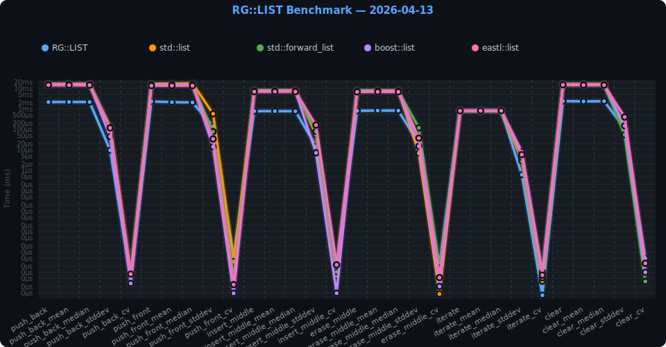
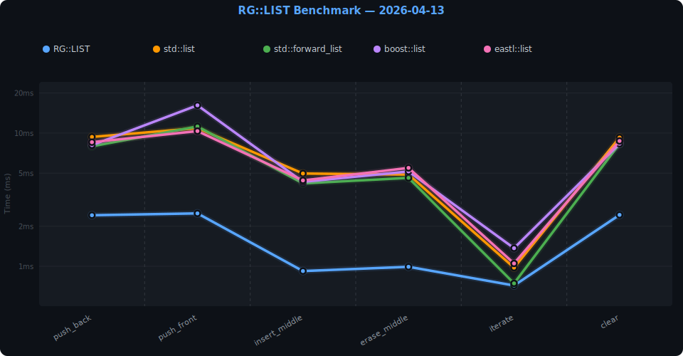

# 🏎️ Rinegine Benchmarks
<style>
details {
  background: #0d1117;
  border: 1px solid #30363d;
  border-radius: 8px;
  padding: 0px 25px;
  margin: 12px 0;
  color: #c9d1d9;
  overflow: hidden;
}
details summary {
  color: #ffffff !important;
  font-weight: 500;
  cursor: pointer;
  padding: 8px;
  margin: 0px -20px;
  border-radius: 4px;
  transition: background 0.2s;
}
details::details-content {
  transition: height 1.0s ease-out, content-visibility 1.0s allow-discrete;
  height: 0;
  overflow: hidden;
  content-visibility: hidden;
}

details[open]::details-content {
  height: auto;
  content-visibility: visible;
}
:root {
  interpolate-size: allow-keywords;
}

</style>
<details>
<summary>
Rinegine::Kernel::LIST Benchmark
</summary>
<div class="details-content"><div>

> Данный тип временно находится в модуле WIP

Сравнительный бенчмарк связного списка **RG::LIST** против 4 альтернатив:
`std::list`, `std::forward_list`, `boost::list`, `eastl::list`.

## 📊 Результаты

N=500 000 · GCC 15.2.1 `-O3 -march=native` · логарифмическая шкала  
## Подробные результаты с минимальной погрешностью  


<!-- include: list/full/result.md -->
| Operation | RG::LIST | std::list | std::forward_list | boost::list | eastl::list |
|---|---|---|---|---|---|
| **push_back** | 2.14 ms | 16.20 ms | 15.16 ms | 15.27 ms | 14.38 ms |
| **push_back_mean** | 2.14 ms | 16.32 ms | 15.08 ms | 15.30 ms | 14.25 ms |
| **push_back_median** | 2.14 ms | 16.30 ms | 15.14 ms | 15.28 ms | 14.22 ms |
| **push_back_stddev** | 0.01 ms | 0.13 ms | 0.13 ms | 0.04 ms | 0.12 ms |
| **push_back_cv** | 0.00 ms | 0.00 ms | 0.00 ms | 0.00 ms | 0.00 ms |
| **push_front** | 2.26 ms | 16.37 ms | 14.50 ms | 14.77 ms | 13.51 ms |
| **push_front_mean** | 2.10 ms | 17.02 ms | 14.59 ms | 14.76 ms | 13.49 ms |
| **push_front_median** | 2.03 ms | 17.32 ms | 14.62 ms | 14.77 ms | 13.50 ms |
| **push_front_stddev** | 0.14 ms | 0.56 ms | 0.08 ms | 0.01 ms | 0.03 ms |
| **push_front_cv** | 0.00 ms | 0.00 ms | 0.00 ms | 0.00 ms | 0.00 ms |
| **insert_middle** | 0.76 ms | 7.94 ms | 7.35 ms | 7.35 ms | 6.85 ms |
| **insert_middle_mean** | 0.76 ms | 8.00 ms | 7.41 ms | 7.35 ms | 6.90 ms |
| **insert_middle_median** | 0.76 ms | 8.02 ms | 7.38 ms | 7.34 ms | 6.85 ms |
| **insert_middle_stddev** | 0.01 ms | 0.05 ms | 0.08 ms | 0.01 ms | 0.16 ms |
| **insert_middle_cv** | 0.00 ms | 0.00 ms | 0.00 ms | 0.00 ms | 0.00 ms |
| **erase_middle** | 0.80 ms | 7.77 ms | 7.46 ms | 7.25 ms | 6.66 ms |
| **erase_middle_mean** | 0.81 ms | 7.77 ms | 7.32 ms | 7.24 ms | 6.70 ms |
| **erase_middle_median** | 0.80 ms | 7.78 ms | 7.28 ms | 7.23 ms | 6.71 ms |
| **erase_middle_stddev** | 0.02 ms | 0.01 ms | 0.12 ms | 0.01 ms | 0.04 ms |
| **erase_middle_cv** | 0.00 ms | 0.00 ms | 0.00 ms | 0.00 ms | 0.00 ms |
| **iterate** | 0.80 ms | 0.79 ms | 0.80 ms | 0.79 ms | 0.79 ms |
| **iterate_mean** | 0.80 ms | 0.79 ms | 0.79 ms | 0.79 ms | 0.79 ms |
| **iterate_median** | 0.80 ms | 0.79 ms | 0.80 ms | 0.79 ms | 0.79 ms |
| **iterate_stddev** | 0.00 ms | 0.00 ms | 0.00 ms | 0.01 ms | 0.01 ms |
| **iterate_cv** | 0.00 ms | 0.00 ms | 0.00 ms | 0.00 ms | 0.00 ms |
| **clear** | 2.36 ms | 15.87 ms | 14.78 ms | 14.88 ms | 14.81 ms |
| **clear_mean** | 2.29 ms | 15.99 ms | 14.80 ms | 14.76 ms | 14.39 ms |
| **clear_median** | 2.34 ms | 15.98 ms | 14.78 ms | 14.79 ms | 14.35 ms |
| **clear_stddev** | 0.11 ms | 0.12 ms | 0.05 ms | 0.15 ms | 0.39 ms |
| **clear_cv** | 0.00 ms | 0.00 ms | 0.00 ms | 0.00 ms | 0.00 ms |

### 🏆 Лидеры по операциям

| Operation | 🥇 1-е место | 🥈 2-е место | 🥉 3-е место |
|---|---|---|---|
| **push_back** | **RG::LIST** (2.14 ms) | **eastl::list** (14.38 ms) | **std::forward_list** (15.16 ms) |
| **push_front** | **RG::LIST** (2.26 ms) | **eastl::list** (13.51 ms) | **std::forward_list** (14.50 ms) |
| **insert_middle** | **RG::LIST** (0.76 ms) | **eastl::list** (6.85 ms) | **std::forward_list** (7.35 ms) |
| **erase_middle** | **RG::LIST** (0.80 ms) | **eastl::list** (6.66 ms) | **boost::list** (7.25 ms) |
| **iterate** | **boost::list** (0.79 ms) | **std::list** (0.79 ms) | **eastl::list** (0.79 ms) |
| **clear** | **RG::LIST** (2.36 ms) | **std::forward_list** (14.78 ms) | **eastl::list** (14.81 ms) |

<!-- endinclude -->

## Результаты с большей погрешностью, отражающие работу при малой/средней нагрузке системы  

<!-- include: list/fast/result.md -->
| Operation | RG::LIST | std::list | std::forward_list | boost::list | eastl::list |
|---|---|---|---|---|---|
| **push_back** | 2.34 ms | 15.43 ms | 14.95 ms | 15.12 ms | 13.19 ms |
| **push_front** | 2.19 ms | 16.02 ms | 14.10 ms | 14.56 ms | 13.81 ms |
| **insert_middle** | 0.75 ms | 7.84 ms | 7.25 ms | 7.14 ms | 6.84 ms |
| **erase_middle** | 0.79 ms | 7.75 ms | 7.20 ms | 7.19 ms | 6.68 ms |
| **iterate** | 0.90 ms | 1.00 ms | 0.88 ms | 0.87 ms | 0.89 ms |
| **clear** | 2.10 ms | 15.96 ms | 14.46 ms | 14.99 ms | 13.53 ms |

### 🏆 Лидеры по операциям

| Operation | 🥇 1-е место | 🥈 2-е место | 🥉 3-е место |
|---|---|---|---|
| **push_back** | **RG::LIST** (2.34 ms) | **eastl::list** (13.19 ms) | **std::forward_list** (14.95 ms) |
| **push_front** | **RG::LIST** (2.19 ms) | **eastl::list** (13.81 ms) | **std::forward_list** (14.10 ms) |
| **insert_middle** | **RG::LIST** (0.75 ms) | **eastl::list** (6.84 ms) | **boost::list** (7.14 ms) |
| **erase_middle** | **RG::LIST** (0.79 ms) | **eastl::list** (6.68 ms) | **boost::list** (7.19 ms) |
| **iterate** | **boost::list** (0.87 ms) | **std::forward_list** (0.88 ms) | **eastl::list** (0.89 ms) |
| **clear** | **RG::LIST** (2.10 ms) | **eastl::list** (13.53 ms) | **std::forward_list** (14.46 ms) |

<!-- endinclude -->


## 🛠 Сборка и запуск

### Зависимости (Arch Linux)

```bash
sudo pacman -S boost 
yay -S eastl benchmark-git  # (Из AUR) Google Benchmark
```

### Сборка

```bash
../Rinegine/bin/rgcmd
sh ./run_bench.sh # для подробных результатов с уменьшением влияния нагрузки на систему и редактированием README.md
sh ./update_result.sh # для быстрого бенчмарка с обычным влиянием нагрузки системы на результаты и редактированием README.md
./benchmark_runner --benchmark_min_time=500ms # быстрый бенчмарк в терминале
```

### Фильтрация

```bash
./benchmark_runner --benchmark_filter="RG::LIST/.*"
./benchmark_runner --benchmark_filter="push_front"
```

</div></div>
</details>