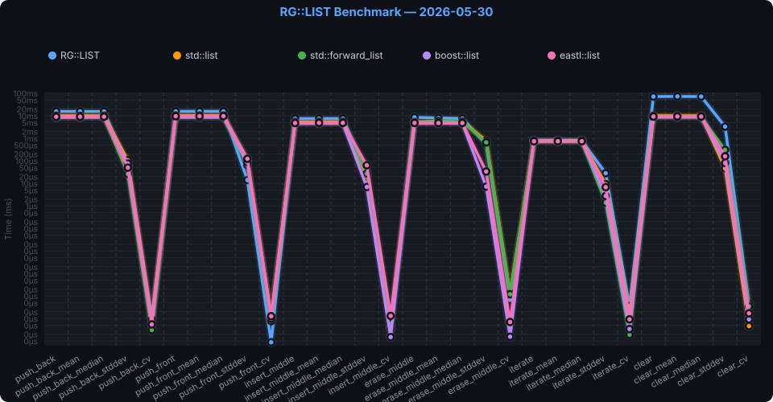
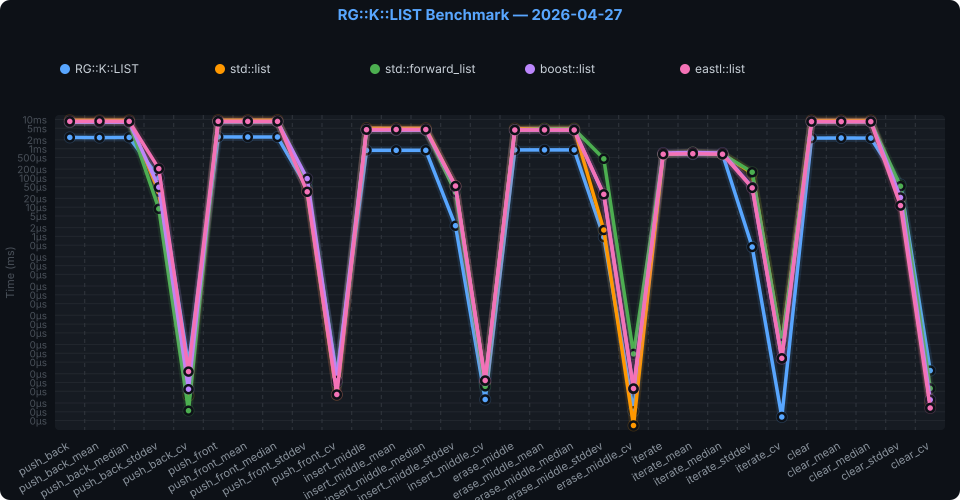
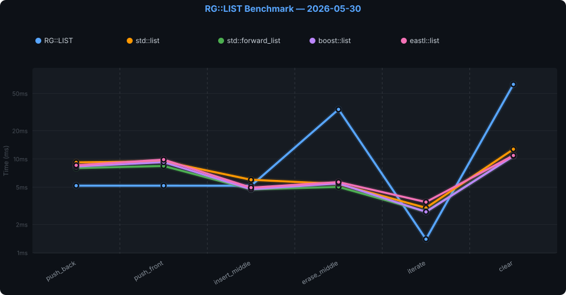
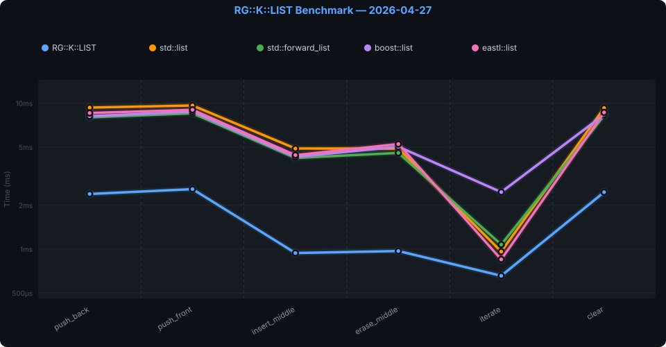

# 🏎️ Rinegine Benchmarks
<!-- Оказывается стили на github не поддерживаются :(
<style>
details {
  background: #0d1117;
  border: 1px solid #30363d;
  border-radius: 8px;
  padding: 0px 25px;
  margin: 12px 0;
  color: #c9d1d9;
  overflow: hidden;
}
details summary {
  color: #ffffff !important;
  font-weight: 500;
  cursor: pointer;
  padding: 8px;
  margin: 0px -20px;
  border-radius: 4px;
  transition: background 0.2s;
}
details::details-content {
  transition: height 1.0s ease-out, content-visibility 1.0s allow-discrete;
  height: 0;
  overflow: hidden;
  content-visibility: hidden;
}

details[open]::details-content {
  height: auto;
  content-visibility: visible;
}
:root {
  interpolate-size: allow-keywords;
}
</style> -->
### Внимание! Данные типы ещё не доделаны и будут изменены в будущем  
<details>
<summary>
Rinegine::Kernel::LIST Benchmark
</summary>
<div class="details-content"><div>

> Данный тип временно находится в модуле WIP

Сравнительный бенчмарк связного списка **RG::LIST** против 4 альтернатив:
`std::list`, `std::forward_list`, `boost::list`, `eastl::list`.

## 📊 Результаты

N=500 000 · GCC 15.2.1 `-O3 -march=native` · логарифмическая шкала  
## Подробные результаты с минимальной погрешностью  



<!-- include: list/full/result.md -->
| Operation | RG::LIST | std::list | std::forward_list | boost::list | eastl::list |
|---|---|---|---|---|---|
| **push_back** | 1.69 ms | 11.02 ms | 10.46 ms | 10.28 ms | 9.57 ms |
| **push_back_mean** | 1.73 ms | 11.05 ms | 10.26 ms | 10.33 ms | 9.54 ms |
| **push_back_median** | 1.69 ms | 11.02 ms | 10.16 ms | 10.29 ms | 9.56 ms |
| **push_back_stddev** | 0.09 ms | 0.06 ms | 0.18 ms | 0.08 ms | 0.05 ms |
| **push_back_cv** | 0.00 ms | 0.00 ms | 0.00 ms | 0.00 ms | 0.00 ms |
| **push_front** | 1.65 ms | 11.30 ms | 10.29 ms | 10.34 ms | 10.00 ms |
| **push_front_mean** | 1.66 ms | 11.23 ms | 10.27 ms | 10.48 ms | 9.81 ms |
| **push_front_median** | 1.65 ms | 11.20 ms | 10.29 ms | 10.51 ms | 9.86 ms |
| **push_front_stddev** | 0.02 ms | 0.06 ms | 0.05 ms | 0.13 ms | 0.22 ms |
| **push_front_cv** | 0.00 ms | 0.00 ms | 0.00 ms | 0.00 ms | 0.00 ms |
| **insert_middle** | 0.62 ms | 5.75 ms | 5.24 ms | 5.30 ms | 4.94 ms |
| **insert_middle_mean** | 0.62 ms | 5.73 ms | 5.25 ms | 5.31 ms | 5.02 ms |
| **insert_middle_median** | 0.62 ms | 5.72 ms | 5.24 ms | 5.31 ms | 4.94 ms |
| **insert_middle_stddev** | 0.00 ms | 0.02 ms | 0.01 ms | 0.01 ms | 0.15 ms |
| **insert_middle_cv** | 0.00 ms | 0.00 ms | 0.00 ms | 0.00 ms | 0.00 ms |
| **erase_middle** | 0.64 ms | 5.72 ms | 5.17 ms | 5.30 ms | 4.81 ms |
| **erase_middle_mean** | 0.65 ms | 5.74 ms | 5.22 ms | 5.27 ms | 4.83 ms |
| **erase_middle_median** | 0.64 ms | 5.72 ms | 5.22 ms | 5.25 ms | 4.83 ms |
| **erase_middle_stddev** | 0.00 ms | 0.07 ms | 0.05 ms | 0.03 ms | 0.01 ms |
| **erase_middle_cv** | 0.00 ms | 0.00 ms | 0.00 ms | 0.00 ms | 0.00 ms |
| **iterate** | 0.78 ms | 0.74 ms | 0.74 ms | 0.74 ms | 0.74 ms |
| **iterate_mean** | 0.76 ms | 0.74 ms | 0.75 ms | 0.76 ms | 0.74 ms |
| **iterate_median** | 0.75 ms | 0.74 ms | 0.74 ms | 0.75 ms | 0.74 ms |
| **iterate_stddev** | 0.02 ms | 0.01 ms | 0.01 ms | 0.03 ms | 0.00 ms |
| **iterate_cv** | 0.00 ms | 0.00 ms | 0.00 ms | 0.00 ms | 0.00 ms |
| **clear** | 1.58 ms | 11.11 ms | 10.34 ms | 10.39 ms | 9.60 ms |
| **clear_mean** | 1.60 ms | 11.11 ms | 10.24 ms | 10.35 ms | 9.56 ms |
| **clear_median** | 1.58 ms | 11.11 ms | 10.21 ms | 10.36 ms | 9.56 ms |
| **clear_stddev** | 0.04 ms | 0.01 ms | 0.09 ms | 0.05 ms | 0.04 ms |
| **clear_cv** | 0.00 ms | 0.00 ms | 0.00 ms | 0.00 ms | 0.00 ms |

### 🏆 Лидеры по операциям

| Operation | 🥇 1-е место | 🥈 2-е место | 🥉 3-е место |
|---|---|---|---|
| **push_back** | **RG::LIST** (1.69 ms) | **eastl::list** (9.57 ms) | **boost::list** (10.28 ms) |
| **push_front** | **RG::LIST** (1.65 ms) | **eastl::list** (10.00 ms) | **std::forward_list** (10.29 ms) |
| **insert_middle** | **RG::LIST** (0.62 ms) | **eastl::list** (4.94 ms) | **std::forward_list** (5.24 ms) |
| **erase_middle** | **RG::LIST** (0.64 ms) | **eastl::list** (4.81 ms) | **std::forward_list** (5.17 ms) |
| **iterate** | **std::forward_list** (0.74 ms) | **std::list** (0.74 ms) | **eastl::list** (0.74 ms) |
| **clear** | **RG::LIST** (1.58 ms) | **eastl::list** (9.60 ms) | **std::forward_list** (10.34 ms) |

<!-- endinclude -->

> Прошлое  



| Operation | RG::LIST | std::list | std::forward_list | boost::list | eastl::list |
|---|---|---|---|---|---|
| **push_back** | 2.44 ms | 9.43 ms | 8.10 ms | 8.22 ms | 8.61 ms |
| **push_back_mean** | 2.40 ms | 9.40 ms | 8.09 ms | 8.16 ms | 8.71 ms |
| **push_back_median** | 2.44 ms | 9.41 ms | 8.09 ms | 8.14 ms | 8.61 ms |
| **push_back_stddev** | 0.10 ms | 0.03 ms | 0.01 ms | 0.05 ms | 0.21 ms |
| **push_back_cv** | 0.00 ms | 0.00 ms | 0.00 ms | 0.00 ms | 0.00 ms |
| **push_front** | 2.54 ms | 9.49 ms | 8.26 ms | 8.31 ms | 8.66 ms |
| **push_front_mean** | 2.51 ms | 9.48 ms | 8.21 ms | 8.40 ms | 8.62 ms |
| **push_front_median** | 2.52 ms | 9.49 ms | 8.25 ms | 8.39 ms | 8.62 ms |
| **push_front_stddev** | 0.04 ms | 0.04 ms | 0.08 ms | 0.10 ms | 0.03 ms |
| **push_front_cv** | 0.00 ms | 0.00 ms | 0.00 ms | 0.00 ms | 0.00 ms |
| **insert_middle** | 0.88 ms | 5.04 ms | 4.33 ms | 4.34 ms | 4.48 ms |
| **insert_middle_mean** | 0.88 ms | 4.98 ms | 4.34 ms | 4.34 ms | 4.53 ms |
| **insert_middle_median** | 0.88 ms | 4.97 ms | 4.33 ms | 4.34 ms | 4.53 ms |
| **insert_middle_stddev** | 0.00 ms | 0.05 ms | 0.03 ms | 0.05 ms | 0.05 ms |
| **insert_middle_cv** | 0.00 ms | 0.00 ms | 0.00 ms | 0.00 ms | 0.00 ms |
| **erase_middle** | 0.91 ms | 4.89 ms | 4.37 ms | 4.33 ms | 4.37 ms |
| **erase_middle_mean** | 0.91 ms | 4.89 ms | 4.76 ms | 4.34 ms | 4.39 ms |
| **erase_middle_median** | 0.91 ms | 4.89 ms | 4.67 ms | 4.33 ms | 4.38 ms |
| **erase_middle_stddev** | 0.00 ms | 0.00 ms | 0.45 ms | 0.03 ms | 0.03 ms |
| **erase_middle_cv** | 0.00 ms | 0.00 ms | 0.00 ms | 0.00 ms | 0.00 ms |
| **iterate** | 0.65 ms | 0.65 ms | 0.66 ms | 0.71 ms | 0.65 ms |
| **iterate_mean** | 0.65 ms | 0.73 ms | 0.75 ms | 0.74 ms | 0.68 ms |
| **iterate_median** | 0.65 ms | 0.65 ms | 0.66 ms | 0.71 ms | 0.65 ms |
| **iterate_stddev** | 0.00 ms | 0.14 ms | 0.16 ms | 0.05 ms | 0.05 ms |
| **iterate_cv** | 0.00 ms | 0.00 ms | 0.00 ms | 0.00 ms | 0.00 ms |
| **clear** | 2.30 ms | 9.29 ms | 8.33 ms | 8.32 ms | 8.45 ms |
| **clear_mean** | 2.33 ms | 9.28 ms | 8.29 ms | 8.30 ms | 8.44 ms |
| **clear_median** | 2.30 ms | 9.29 ms | 8.31 ms | 8.31 ms | 8.45 ms |
| **clear_stddev** | 0.06 ms | 0.02 ms | 0.05 ms | 0.02 ms | 0.01 ms |
| **clear_cv** | 0.00 ms | 0.00 ms | 0.00 ms | 0.00 ms | 0.00 ms |

### 🏆 Лидеры по операциям

| Operation | 🥇 1-е место | 🥈 2-е место | 🥉 3-е место |
|---|---|---|---|
| **push_back** | **RG::LIST** (2.44 ms) | **std::forward_list** (8.10 ms) | **boost::list** (8.22 ms) |
| **push_front** | **RG::LIST** (2.54 ms) | **std::forward_list** (8.26 ms) | **boost::list** (8.31 ms) |
| **insert_middle** | **RG::LIST** (0.88 ms) | **std::forward_list** (4.33 ms) | **boost::list** (4.34 ms) |
| **erase_middle** | **RG::LIST** (0.91 ms) | **boost::list** (4.33 ms) | **std::forward_list** (4.37 ms) |
| **iterate** | **std::list** (0.65 ms) | **eastl::list** (0.65 ms) | **RG::LIST** (0.65 ms) |
| **clear** | **RG::LIST** (2.30 ms) | **boost::list** (8.32 ms) | **std::forward_list** (8.33 ms) |


## Результаты с большей погрешностью, отражающие работу при малой/средней нагрузке системы  

<!-- include: list/fast/result.md -->
| Operation | RG::LIST | std::list | std::forward_list | boost::list | eastl::list |
|---|---|---|---|---|---|
| **push_back** | 1.82 ms | 11.40 ms | 10.47 ms | 10.60 ms | 9.64 ms |
| **push_front** | 1.80 ms | 11.60 ms | 10.34 ms | 10.85 ms | 9.87 ms |
| **insert_middle** | 0.61 ms | 5.83 ms | 5.33 ms | 5.43 ms | 5.04 ms |
| **erase_middle** | 0.66 ms | 5.81 ms | 5.39 ms | 5.60 ms | 5.16 ms |
| **iterate** | 0.80 ms | 0.78 ms | 0.79 ms | 0.80 ms | 0.79 ms |
| **clear** | 1.68 ms | 11.36 ms | 10.39 ms | 10.59 ms | 9.66 ms |

### 🏆 Лидеры по операциям

| Operation | 🥇 1-е место | 🥈 2-е место | 🥉 3-е место |
|---|---|---|---|
| **push_back** | **RG::LIST** (1.82 ms) | **eastl::list** (9.64 ms) | **std::forward_list** (10.47 ms) |
| **push_front** | **RG::LIST** (1.80 ms) | **eastl::list** (9.87 ms) | **std::forward_list** (10.34 ms) |
| **insert_middle** | **RG::LIST** (0.61 ms) | **eastl::list** (5.04 ms) | **std::forward_list** (5.33 ms) |
| **erase_middle** | **RG::LIST** (0.66 ms) | **eastl::list** (5.16 ms) | **std::forward_list** (5.39 ms) |
| **iterate** | **std::list** (0.78 ms) | **std::forward_list** (0.79 ms) | **eastl::list** (0.79 ms) |
| **clear** | **RG::LIST** (1.68 ms) | **eastl::list** (9.66 ms) | **std::forward_list** (10.39 ms) |

<!-- endinclude -->

> Прошлое  


| Operation | RG::LIST | std::list | std::forward_list | boost::list | eastl::list |
|---|---|---|---|---|---|
| **push_back** | 2.39 ms | 9.33 ms | 8.01 ms | 8.14 ms | 8.57 ms |
| **push_front** | 2.58 ms | 9.64 ms | 8.52 ms | 8.77 ms | 9.01 ms |
| **insert_middle** | 0.94 ms | 4.89 ms | 4.22 ms | 4.29 ms | 4.41 ms |
| **erase_middle** | 0.97 ms | 4.89 ms | 4.56 ms | 5.03 ms | 5.25 ms |
| **iterate** | 0.66 ms | 0.96 ms | 1.07 ms | 2.46 ms | 0.85 ms |
| **clear** | 2.46 ms | 9.27 ms | 8.23 ms | 8.35 ms | 8.64 ms |

### 🏆 Лидеры по операциям

| Operation | 🥇 1-е место | 🥈 2-е место | 🥉 3-е место |
|---|---|---|---|
| **push_back** | **RG::LIST** (2.39 ms) | **std::forward_list** (8.01 ms) | **boost::list** (8.14 ms) |
| **push_front** | **RG::LIST** (2.58 ms) | **std::forward_list** (8.52 ms) | **boost::list** (8.77 ms) |
| **insert_middle** | **RG::LIST** (0.94 ms) | **std::forward_list** (4.22 ms) | **boost::list** (4.29 ms) |
| **erase_middle** | **RG::LIST** (0.97 ms) | **std::forward_list** (4.56 ms) | **std::list** (4.89 ms) |
| **iterate** | **RG::LIST** (0.66 ms) | **eastl::list** (0.85 ms) | **std::list** (0.96 ms) |
| **clear** | **RG::LIST** (2.46 ms) | **std::forward_list** (8.23 ms) | **boost::list** (8.35 ms) |


## 🛠 Сборка и запуск

### Зависимости (Arch Linux)

```bash
sudo pacman -S boost 
yay -S eastl benchmark-git  # (Из AUR) Google Benchmark
```

### Сборка и запуск

```bash
../Rinegine/bin/rgcmd
sh ./list/full/run.sh # для подробных результатов с уменьшением влияния нагрузки системы на результаты и редактированием README.md
sh ./list/fast/run.sh # для быстрого бенчмарка с обычным влиянием нагрузки системы на результаты и редактированием README.md
sh ./run.sh # для запуска двух бенчмарков подряд с редактированием README.md
./benchmark_runner --help # помощь по командам
./benchmark_runner # быстрый бенчмарк в терминале
```

### Фильтрация

```bash
./benchmark_runner --benchmark_filter="RG::LIST/.*"
./benchmark_runner --benchmark_filter="push_front"
```

</div></div>
</details>
